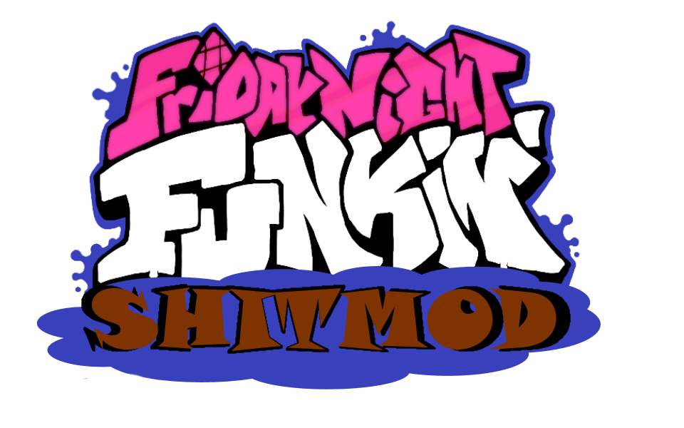

# Friday Night Funkin': SHITMOD EDITION

OKAY LISTEN UP, THIS IS JUST KADE ENGINE BUT WITH EVER SO SLIGHT TWEAKS TO DISCORD STATUS MESSAGES AND OTHER MINOR SHIT LIKE CHANGING SONG NAMES INTERNALLY SO I COULD HAVE PICO NAMED PERCY AND RENAME SPOOKEEZ TO POOPEEZ BECAUSE I HAVE THE HUMOUR OF A TEN YEAR OLD.

A MAJORITY OF THE CHANGES ARE ACTUALLY DONE THROUGH EDITING THE SONGS SO THEY HAVE FUNNY STUFF IN THEM AND ALSO RECHARTING THE STAGES SO THEY FIT THE NEW SHIT MUSIC.
ALSO VISUAL CHANGES LIKE THE DAD FROM WEEK 1 IS NOW THE "sToP PosTing AbouT amONG US!!!" GUY. IF YOU WANT TO KNOW ALL THE CHANGES JUST DOWNLOAD AND BUILD THE PROJECT YOURSELF DAMN

OR WAIT FOR ME TO EVENTUALLY RELEASE THIS SOMEWHERE PUBLICLY IDK :SHRUG EMOTE:

THATS ALL OKAY BYE!!

### If you want to contribute to Kade Engine, read [this](https://github.com/KadeDev/Kade-Engine/blob/stable/CONTRIBUTING.md) first.
### If you want to build Kade Engine, read [this](https://github.com/KadeDev/Kade-Engine/blob/stable/docs/building.md).

## Friday Night Funkin'
**Friday Night Funkin'** is a rhythm game originally made for Ludum Dare 47 "Stuck In a Loop".

Links: **[itch.io page](https://ninja-muffin24.itch.io/funkin) ⋅ [Newgrounds](https://www.newgrounds.com/portal/view/770371) ⋅ [source code on GitHub](https://github.com/ninjamuffin99/Funkin)**
> Uh oh! Your tryin to kiss ur hot girlfriend, but her MEAN and EVIL dad is trying to KILL you! He's an ex-rockstar, the only way to get to his heart? The power of music... 

## Kade Engine
**Kade Engine** is a mod for Friday Night Funkin', including a full engine rework, replays, and more.

Links: **[GameBanana mod page](https://gamebanana.com/gamefiles/16761) ⋅ [play in browser](https://funkin.puyo.xyz) ⋅ [latest stable release](https://github.com/KadeDev/Kade-Engine/releases/latest) ⋅ [latest development build (windows)](https://ci.appveyor.com/project/KadeDev/kade-engine-windows/branch/master/artifacts) ⋅ [latest development build (macOS)](https://ci.appveyor.com/project/KadeDev/kade-engine-macos/branch/master/artifacts) ⋅ [latest development build (linux)](https://ci.appveyor.com/project/KadeDev/kade-engine-linux/branch/master/artifacts)**

**REMEMBER**: This is a **mod**. This is not the vanilla game and should be treated as a **modification**. This is not and probably will never be official, so don't get confused.

## Website ([KadeDev.github.io/kade-engine/](https://KadeDev.github.io/Kade-Engine/))
If you're looking for documentation, changelogs, or guides, you can find those on the Kade Engine website.

OKAY ON SECOND THOUGHT YOU DON'T NEED TO SEE THIS SAME PREVIEW AND FEATURE SHIT, GO TO THE ORIGINAL [KADE ENGINE GITHUB](https://KadeDev.github.io/Kade-Engine/) TO SEE THEM IF YOU REALLY WANT TO

# Credits
### Friday Night Funkin'
 - [ninjamuffin99](https://twitter.com/ninja_muffin99) - Programming
 - [PhantomArcade3K](https://twitter.com/phantomarcade3k) and [Evilsk8r](https://twitter.com/evilsk8r) - Art
 - [Kawai Sprite](https://twitter.com/kawaisprite) - Music

This game was made with love to Newgrounds and its community. Extra love to Tom Fulp.
### Kade Engine
- [KadeDeveloper](https://twitter.com/KadeDeveloper) - Maintainer and lead programmer
- [The contributors](https://github.com/KadeDev/Kade-Engine/graphs/contributors)

### Shoutouts
- [GWebDev](https://github.com/GrowtopiaFli) - Video Code
- [Rozebud](https://github.com/ThatRozebudDude) - Ideas (that I stole)
- [Puyo](https://github.com/puyoxyz) - Setting up appveyor and a lot of other help
- [Smokey](https://github.com/Smokey555) - telling me that I should do the tricky asset loading
- [Poco](https://github.com/poco0317) - math degree (aka most of the fucking math in this project)
- [Fox](https://twitter.com/FoxeruKun) - circle noteskins
- [Orbyy](https://twitter.com/orbyynew) - pixel circle noteskins
- [Shubs](https://github.com/Yoshubs) - Forever Engine dump cache